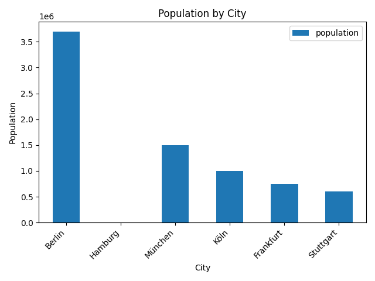
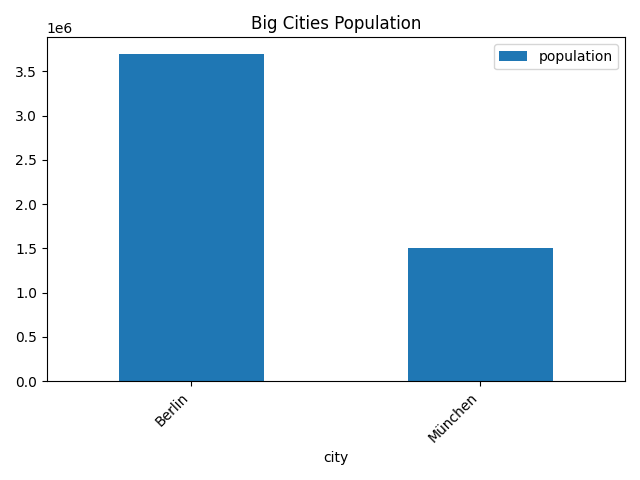
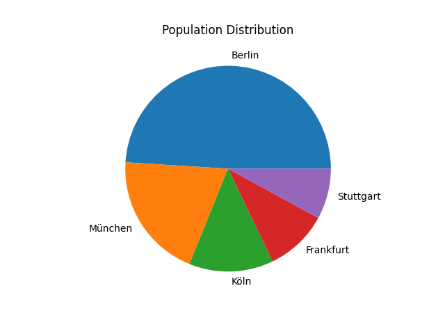

# Open Data Analysis Project

Projekt: Verarbeitung, Bereinigung und Analyse von CSV-Daten mit Python und pandas.

## Features

- Laden von CSV-Daten (pandas)
- Datenanalyse (Durchschnitt, Maximum)
- Filtern von Daten
- **Datenbereinigung (Data Cleaning)**:
  - Entfernen von fehlenden Werten
  - Ersetzen fehlender Daten
  - Entfernen von Duplikaten
  - Bereinigung von Strings
  - Korrektur von Datentypen
  
---

## Data Cleaning:

In diesem Schritt werden typische Probleme in realen Datensätzen behandelt:

### Erkannte Probleme:

- Fehlende Werte (NaN)
- Doppelte Einträge
- Unsaubere Strings (Leerzeichen)
- Falsche Datentypen
- Diagramme erstellen

---

## Verwendete Methoden

```python
df.isnull().sum()        # Fehlende Werte erkennen
df.dropna()              # Zeilen entfernen
df.fillna()              # Werte ersetzen
df.drop_duplicates()     # Duplikate entfernen
df.astype()              # Datentyp ändern
df.str.strip()           # Leerzeichen entfernen
df.plot()                # Diagramm erstellen
plt.show()               # Diagramm zeigen als datei.png

---

## 📈 Visualisierung

### Bar Chart – Alle Städte


### Bar Chart – Große Städte


### Pie Chart – Verteilung

